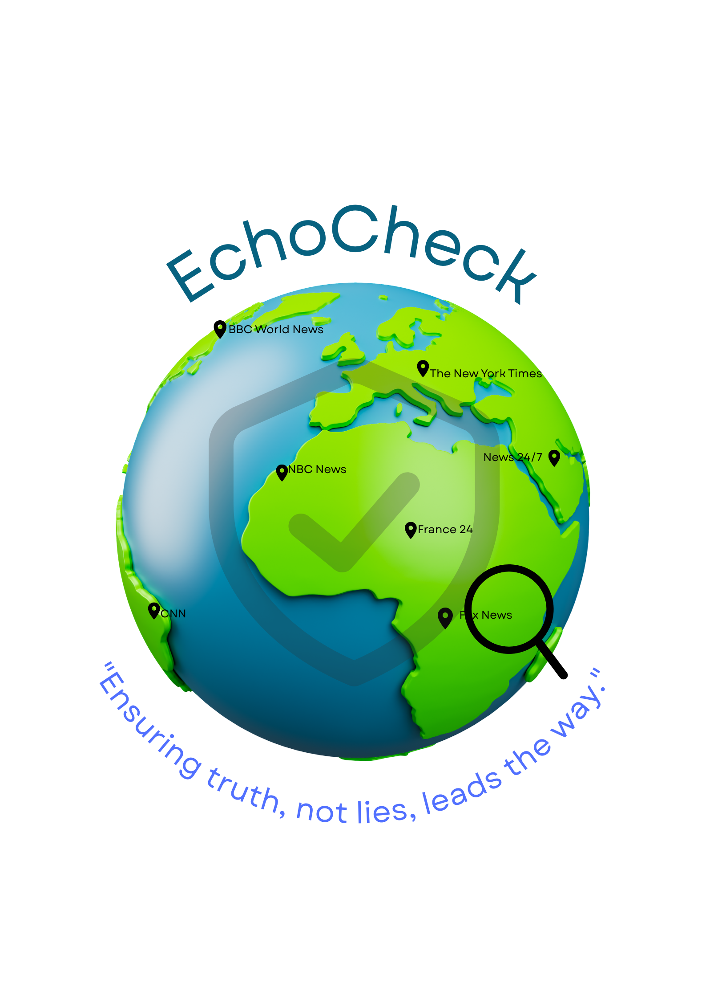

<p align="center">
  
</p>

<h1 align="center">EchoCheck</h1>

<p align="center">
  <strong>AI-Powered Real-Time Fact Verification System</strong>
</p>

<p align="center">
  
  
  
  
  
</p>

---

## Overview

**EchoCheck** is a full-stack AI fact-checking web application that verifies user-submitted claims in real time using a **Retrieval-Augmented Generation (RAG)** pipeline. It combines live Google search results with Google Gemini AI analysis to deliver evidence-based verdicts, complete with source bias analysis.

<p align="center">
  
</p>

---

## Features

| Feature | Description |
|---------|-------------|
| **Real-Time Fact Checking** | Queries live Google search results via SerpAPI to ground analysis in current data |
| **AI-Powered Verdicts** | Uses Google Gemini AI to classify claims as Confirmed, Debunked, Complex/Mixed, or Inconclusive |
| **Source Bias Analysis** | Estimates political bias (Left-leaning, Center, Right-leaning) of each evidence source with an interactive doughnut chart |
| **Sanity Check Layer** | Pre-filters fundamentally false claims (e.g., "the earth is flat") before API calls |
| **Multi-Model Fallback** | Automatically rotates through multiple Gemini models if one hits a rate limit |
| **User Authentication** | Secure email/password auth via Firebase Authentication |
| **Chat History** | Persists past verifications to Cloud Firestore with localStorage fallback |
| **Responsive UI** | Glassmorphic, mobile-friendly interface with animated transitions |

---

## Tech Stack

### Backend
- **Python 3.10+** with **Flask** — REST API server
- **SerpAPI** — Real-time Google Search integration
- **Google Gemini API** — AI-powered claim analysis (RAG)
- **Flask-CORS** — Cross-origin request handling

### Frontend
- **HTML5 / CSS3 / JavaScript** — Vanilla JS (no framework)
- **Tailwind CSS** — Utility-first styling
- **Chart.js** — Bias analysis doughnut chart
- **Firebase SDK v8** — Authentication & Firestore

### Infrastructure
- **Firebase Authentication** — User account management
- **Cloud Firestore** — Chat history persistence
- **localStorage** — Offline fallback for history

---

## Architecture

```
┌─────────────────────────────────────────────────────────┐
│                    Frontend (Browser)                     │
│  index.html + script.js + style.css                      │
│  ┌──────────┐  ┌──────────────┐  ┌───────────────────┐  │
│  │ Firebase  │  │  Chat UI &   │  │  Chart.js Bias    │  │
│  │   Auth    │  │  History     │  │   Visualization   │  │
│  └──────────┘  └──────┬───────┘  └───────────────────┘  │
│                       │ POST /analyze                    │
└───────────────────────┼──────────────────────────────────┘
                        │
                        ▼
┌───────────────────────────────────────────────────────────┐
│                  Backend (Flask - Python)                  │
│  EchoCheck.py                                             │
│  ┌───────────────┐  ┌──────────────┐  ┌───────────────┐  │
│  │ Sanity Check   │─▶│  SerpAPI     │─▶│  Gemini AI    │  │
│  │ (Pre-filter)   │  │  (Search)    │  │  (Analysis)   │  │
│  └───────────────┘  └──────────────┘  └───────────────┘  │
└───────────────────────────────────────────────────────────┘
```

---

## Getting Started

### Prerequisites

- Python 3.10 or higher
- A [SerpAPI](https://serpapi.com/) account and API key
- A [Google AI Studio](https://aistudio.google.com/apikey) Gemini API key
- A [Firebase](https://console.firebase.google.com/) project with Authentication and Firestore enabled

### Installation

1. **Clone the repository**
   ```bash
   git clone https://github.com/AKESH11/EchoCheck.git
   cd EchoCheck
   ```

2. **Install Python dependencies**
   ```bash
   pip install flask flask-cors requests google-search-results
   ```

3. **Set your API keys** (recommended: use environment variables)

   **Windows (CMD):**
   ```cmd
   set SERPAPI_API_KEY=your_serpapi_key_here
   set GEMINI_API_KEY=your_gemini_key_here
   ```

   **Windows (PowerShell):**
   ```powershell
   $env:SERPAPI_API_KEY = "your_serpapi_key_here"
   $env:GEMINI_API_KEY = "your_gemini_key_here"
   ```

   **Linux / macOS:**
   ```bash
   export SERPAPI_API_KEY=your_serpapi_key_here
   export GEMINI_API_KEY=your_gemini_key_here
   ```

4. **Configure Firebase** — Update the `firebaseConfig` object in `script.js` with your own Firebase project credentials.

5. **Set Firestore Security Rules** — In Firebase Console → Firestore → Rules:
   ```
   rules_version = '2';
   service cloud.firestore {
     match /databases/{database}/documents {
       match /users/{userId}/chats/{chatId} {
         allow read, write: if request.auth != null && request.auth.uid == userId;
       }
     }
   }
   ```

6. **Start the backend server**
   ```bash
   python EchoCheck.py
   ```

7. **Open the frontend** — Open `index.html` in your browser (or serve it via a local HTTP server).

---

## API Reference

### `GET /`
Health check endpoint.

**Response:**
```json
{
  "status": "ok",
  "message": "EchoCheck RAG Server is running."
}
```

### `POST /analyze`
Analyze a claim for factual accuracy.

**Request Body:**
```json
{
  "statement": "The Eiffel Tower is in Paris"
}
```

**Response:**
```json
{
  "verdict": "Confirmed",
  "reasoning": "Multiple sources confirm the Eiffel Tower is located in Paris, France.",
  "evidence": [
    {
      "title": "Eiffel Tower",
      "source": "Wikipedia",
      "snippet": "The Eiffel Tower is a lattice tower on the Champ de Mars in Paris...",
      "bias": "Center",
      "url": "https://en.wikipedia.org/wiki/Eiffel_Tower"
    }
  ]
}
```

**Verdict Values:** `Confirmed` | `Debunked` | `Complex/Mixed` | `Inconclusive` | `Fundamentally False` | `API Error`

---

## Project Structure

```
EchoCheck/
├── EchoCheck.py        # Flask backend — RAG pipeline, API routes
├── index.html          # Frontend — HTML structure, modals, chat UI
├── script.js           # Frontend — Auth, chat logic, history, rendering
├── style.css           # Frontend — Glassmorphic theme, animations
├── EchoCheck.png       # Logo asset
├── EchoCheck1.png      # Screenshot asset
├── EcoCheck.pptx       # Presentation
├── code.mp4            # Demo video
└── README.md           # This file
```

---

## How It Works

1. **User submits a claim** via the chat interface
2. **Sanity Check** — Pre-filters obviously false claims (e.g., flat earth) without wasting API calls
3. **Real-Time Search** — SerpAPI fetches the latest Google search results for the claim
4. **AI Analysis** — Google Gemini receives the claim + search evidence and produces:
   - A **verdict** (Confirmed / Debunked / Complex / Inconclusive)
   - A **reasoning** sentence citing the evidence
   - The top 3 **evidence sources** with estimated political bias
5. **Results displayed** — Verdict card, evidence panel, and bias doughnut chart rendered in the UI
6. **History saved** — Chat is persisted to Firestore (with localStorage fallback)

---

## Screenshots

| Auth Screen | Analysis Result |
|:-----------:|:---------------:|
|  |  |

---

## Contributing

1. Fork the repository
2. Create a feature branch (`git checkout -b feature/your-feature`)
3. Commit your changes (`git commit -m 'Add your feature'`)
4. Push to the branch (`git push origin feature/your-feature`)
5. Open a Pull Request

---

## License

This project is open source and available under the [MIT License](LICENSE).

---

<p align="center">
  Built with ❤️ by <a href="https://github.com/AKESH11">AKESH</a>
</p>
